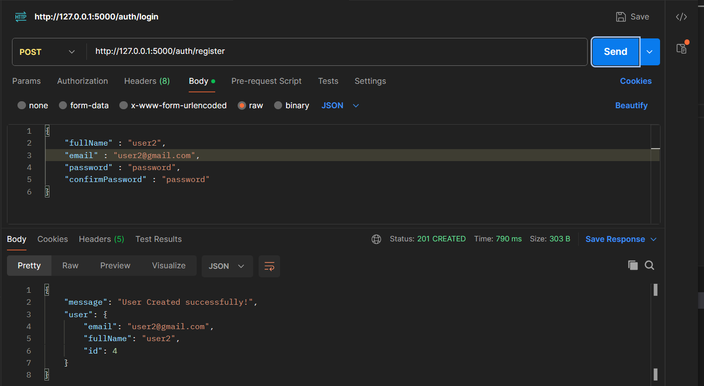
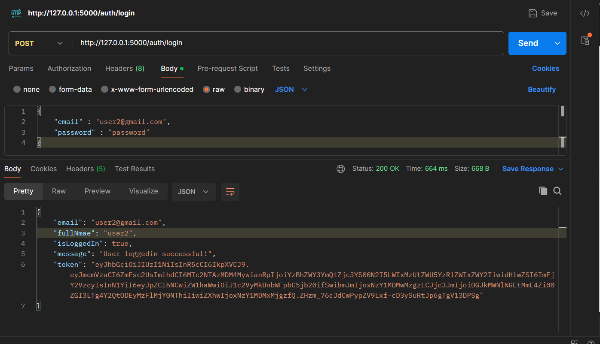
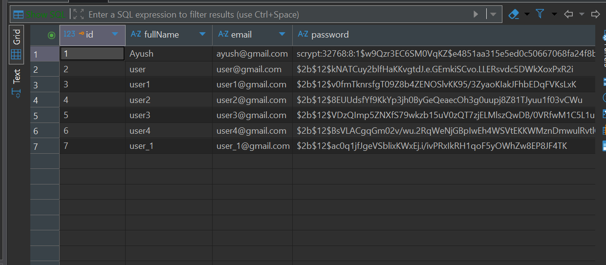

# Intelligent Speech Therapy Platform - Backend

## Project Status
The backend is currently structured as a modular Flask application with a focus on scalability and maintainability.

### Key Features Implemented:
- **Modular Architecture**: The application is divided into blueprints (`auth`, `assessments`) for better code organization.
- **Authentication**: Secure user registration and login endpoints implemented using `Flask-JWT-Extended` and `Bcrypt` for password hashing.
- **Database Integration**: Fully connected to a relational database using `SQLAlchemy`.
- **API Security**: Routes are protected using JWT tokens.

## Project Structure
The project follows a standard Flask factory pattern:
```
Backend/
├── app.py                  # Entry point
├── config.py               # Configuration settings
├── modules/
│   ├── auth/              # Authentication logic (Routes & Models)
│   └── assessments/       # Assessment logic
├── screenshots/            # API demonstration images
└── uploads/                # File upload directory
```

## API Demonstrations

### 1. User Registration
**Endpoint**: `POST /auth/register`
Successfully registers a new user, hashes the password, and initiates the session.



### 2. User Login
**Endpoint**: `POST /auth/login`
Authenticates the user and returns a JWT access token for secure session management.



### 3. Database Connection
**Status**: Connected & Verified
The database connection has been successfully established and tested. User data is correctly being stored and retrieved.


